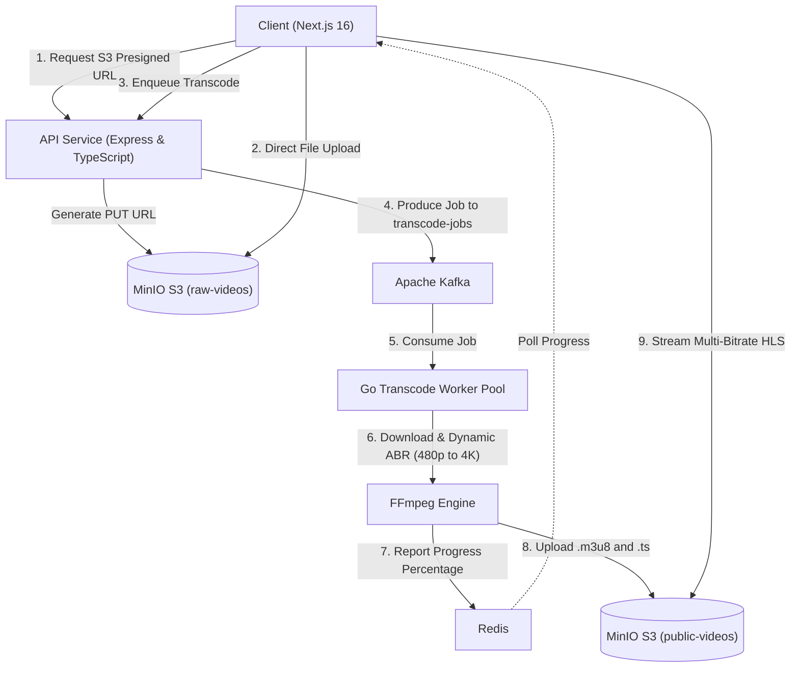

# 🎥 Distributed HLS Transcoder (VOD & Adaptive Bitrate Streaming Engine)

An enterprise-grade, distributed asynchronous video transcoding system built with **Go**, **Apache Kafka**, **Redis**, **FFmpeg**, and **MinIO (S3)**.

---

## 🌟 Highlights & Architecture

- ⚡ **Direct-to-S3 Presigned Ingestion:** Eliminates API server upload bottlenecks by streaming master video files directly to S3/MinIO using presigned PUT URLs.
- 📬 **Decoupled Kafka Event Pipeline:** High-throughput task dispatching using Kafka topic `transcode-jobs`.
- ⚙️ **Dynamic Adaptive Bitrate (ABR) Ladder:** Automatically inspects input source video dimensions via `ffprobe` and downscales into standard HLS renditions up to 4K (2160p, 1440p, 1080p, 720p, 480p) with synchronized GOP keyframes (`-g 48 -keyint_min 48`).
- 📈 **Real-Time Transcode Progress Stream:** Worker parses FFmpeg stderr timestamp progression and pushes percentage status into Redis in real-time.
- 🎛️ **Live Processing Hub & Video Gallery:** Real-time dashboard showing active transcode tasks (`Queued`, `Downloading`, `Transcoding`) with live progress bars, smart auto-polling, and automatic transition to ready state when complete.
- 📺 **Adaptive HLS Web Player:** Next.js 16 + React 19 web application with Hls.js quality switching, stats for nerds overlay, and full library management.

---

## 🏗️ System Architecture



---

## 📋 Prerequisites & Tooling

Ensure the following tools and runtimes are installed on your host machine before running the project:

| Tool | Minimum Version | Purpose | Installation Guide |
|---|---|---|---|
| **Docker & Docker Compose** | Docker v24+ / Compose v2+ | Orchestrating Kafka, Redis, and MinIO | [docker.com](https://docs.docker.com/get-docker/) |
| **Node.js & npm** | Node v18+ (LTS recommended) | Running API Service & Next.js Web Client | [nodejs.org](https://nodejs.org/) |
| **Go** | Go 1.22+ | Compiling and running the Transcode Worker | [go.dev](https://go.dev/doc/install) |
| **FFmpeg & FFprobe** | FFmpeg 5.0+ | Video probing and multi-bitrate HLS segmentation | See instructions below |

### Installing FFmpeg & FFprobe

The Go transcoding worker executes `ffmpeg` and `ffprobe` as sub-processes. Both CLI binaries must be available on your system `PATH`:

- **macOS (Homebrew):**
  ```bash
  brew install ffmpeg
  ```
- **Ubuntu / Debian:**
  ```bash
  sudo apt update && sudo apt install -y ffmpeg
  ```
- **Windows (Chocolatey / Scoop / Winget):**
  ```bash
  winget install Gyan.FFmpeg
  ```
- **Verify Installation:**
  ```bash
  ffmpeg -version
  ffprobe -version
  ```

---

## 🐳 Infrastructure Configurations (`docker-compose.yml`)

The platform's supporting services are packaged into `docker-compose.yml`:

```yaml
services:
  postgres:
    image: postgres:15-alpine
    container_name: video-postgres
    environment:
      POSTGRES_USER: video_user
      POSTGRES_PASSWORD: video_password
      POSTGRES_DB: video_platform
    ports:
      - "5432:5432"
    volumes:
      - postgres_data:/var/lib/postgresql/data
    restart: unless-stopped

  redis:
    image: redis:7-alpine
    container_name: video-redis
    ports:
      - "6379:6379"
    volumes:
      - redis_data:/data
    restart: unless-stopped

  kafka:
    image: confluentinc/cp-kafka:7.5.0
    container_name: video-kafka
    ports:
      - "9092:9092"
      - "29092:29092"
    environment:
      KAFKA_NODE_ID: 1
      KAFKA_PROCESS_ROLES: broker,controller
      KAFKA_CONTROLLER_QUORUM_VOTERS: 1@kafka:29093
      KAFKA_LISTENERS: PLAINTEXT://kafka:9092,CONTROLLER://kafka:29093,PLAINTEXT_HOST://0.0.0.0:29092
      KAFKA_ADVERTISED_LISTENERS: PLAINTEXT://kafka:9092,PLAINTEXT_HOST://localhost:29092
      KAFKA_LISTENER_SECURITY_PROTOCOL_MAP: CONTROLLER:PLAINTEXT,PLAINTEXT:PLAINTEXT,PLAINTEXT_HOST:PLAINTEXT
      KAFKA_CONTROLLER_LISTENER_NAMES: CONTROLLER
      KAFKA_INTER_BROKER_LISTENER_NAME: PLAINTEXT
      CLUSTER_ID: 'MkU3OEVBNTcwNTJENDM2Qk'
      KAFKA_OFFSETS_TOPIC_REPLICATION_FACTOR: 1
    volumes:
      - kafka_data:/var/lib/kafka/data
    restart: unless-stopped

  minio:
    image: quay.io/minio/minio:latest
    container_name: video-minio
    environment:
      MINIO_ROOT_USER: minio_admin
      MINIO_ROOT_PASSWORD: minio_password
      MINIO_API_CORS_ALLOW_ORIGIN: "*"
    command: server /data --console-address ":9001"
    ports:
      - "9000:9000"
      - "9001:9001"
    volumes:
      - minio_data:/data
    restart: unless-stopped

volumes:
  postgres_data:
  redis_data:
  minio_data:
  kafka_data:
```

### Service Architecture Breakdown

1. **PostgreSQL (Local Docker or Cloud)**
   - **Port:** `localhost:5432` (Credentials: `video_user` / `video_password`, DB: `video_platform`).
   - Stores video metadata (`videos` table) defined in `api-service/src/db/schemas/video.schema.ts`.
   - Can also be swapped for any cloud PostgreSQL database (Neon, Supabase, AWS RDS) by changing `DATABASE_URL`.

2. **MinIO (Local S3 Drop-in Replacement)**
   - **Why MinIO?** Used locally to simulate **Amazon S3** so you do not need AWS cloud credentials or incur billing while building locally.
   - **Production Migration:** To integrate with real cloud infrastructure, swap `S3_ENDPOINT` with your AWS S3 bucket endpoint and provide your AWS IAM credentials.
   - **S3 API Port:** `http://localhost:9000`
   - **Web Console Port:** `http://localhost:9001` (Credentials: `minio_admin` / `minio_password`)
   - **Buckets:**
     - `raw-videos`: Private storage bucket receiving raw master video uploads.
     - `public-videos`: Destination bucket for HLS multi-bitrate chunks and playlists.

3. **Apache Kafka (Event Pipeline)**
   - **Broker Port:** `localhost:29092` (host access) and `kafka:9092` (internal network).
   - **KRaft Mode:** Operates in standalone controller/broker mode without ZooKeeper.
   - **Default Topic:** `transcode-jobs` for asynchronous worker job scheduling.

4. **Redis (Real-Time State Store)**
   - **Port:** `localhost:6379`
   - **Cache Keys:** `transcode_progress:<filename>` storing JSON payloads (`status`, `progress` percentage).

---

## ⚙️ Environment Configurations (Isolated per Service)

Each folder contains its own isolated `.env.example` template:

1. **API Service (`api-service/.env.example`):**
   ```bash
   cp api-service/.env.example api-service/.env
   ```
   Contains `PORT`, cloud `DATABASE_URL`, S3/MinIO credentials, Redis URL, and Kafka brokers.

2. **Transcode Worker (`transcode-worker/.env.example`):**
   ```bash
   cp transcode-worker/.env.example transcode-worker/.env
   ```
   Contains S3/MinIO credentials, Redis URL, and Kafka brokers.

3. **Web Client (`client-demo/.env.example`):**
   ```bash
   cp client-demo/.env.example client-demo/.env.local
   ```
   Contains `NEXT_PUBLIC_API_URL` and `NEXT_PUBLIC_S3_PUBLIC_URL`.

---

## 🗂️ Project Layout

```text
distributed-hls-transcoder/
├── api-service/              # Node.js + Express + TypeScript API gateway
│   ├── .env.example          # Server environment template
│   ├── src/
│   │   ├── config/           # Kafka producer, Redis, and S3 clients
│   │   ├── db/               # PostgreSQL client & database initialization
│   │   │   └── schemas/      # Video table schema & interfaces
│   │   ├── controllers/      # Presigned URL generation, job enqueuing, progress
│   │   ├── routes/           # REST endpoints (/api/upload-url, /api/transcode, etc.)
│   │   └── server.ts         # Bootstrapping & services initialization
├── transcode-worker/         # Scalable Go Transcoding Engine
│   ├── .env.example          # Worker environment template
│   ├── cmd/worker/main.go    # Concurrent worker pool daemon
│   ├── internal/
│   │   ├── pool/             # Worker pool management
│   │   ├── transcoder/       # FFmpeg wrapper & dynamic ABR ladder generator
│   │   └── config/           # Kafka consumer, Redis, and MinIO clients
├── client-demo/              # Next.js 16 + React 19 Frontend
│   ├── .env.example          # Client environment template
│   ├── src/app/upload/       # Direct S3 upload & live progress tracking
│   ├── src/app/watch/        # HLS video player & catalog gallery
└── docker-compose.yml        # Kafka, Redis, and MinIO infrastructure
```

---

## 🚀 Step-by-Step Running Guide

### 1. Start Infrastructure
Launch Kafka, Redis, and MinIO:
```bash
docker compose up -d
```
Verify all containers are healthy:
```bash
docker compose ps
```

### 2. Start API Service
```bash
cd api-service
npm install
npm run dev
```
> The API automatically initializes the MinIO buckets (`raw-videos` and `public-videos`) and applies the public read policy on startup. Runs on `http://localhost:3001`.

### 3. Start Transcode Worker
Ensure FFmpeg is installed (`brew install ffmpeg` on macOS), then in a separate terminal:
```bash
cd transcode-worker
go mod download
go run cmd/worker/main.go
```
> The worker pool listens to Kafka `transcode-jobs`, downloads master files from MinIO, invokes FFmpeg to generate multi-bitrate HLS streams, reports progress % into Redis, and uploads `.m3u8` playlists and `.ts` video segments to MinIO.

### 4. Start Web Client
In a fourth terminal window:
```bash
cd client-demo
npm install
npm run dev
```
Open `http://localhost:3000` in your browser:
- **Upload Page (`/upload`):** Select an MP4 video file to upload directly to S3 via presigned URL and trigger the transcoding pipeline.
- **Video Library & Processing Hub (`/watch`):**
  - **Live Processing Cards:** View active transcoding jobs in real-time with circular spinners, progress percentages, and animated gradient progress bars.
  - **Auto-Transition:** Automatically transitions completed videos into ready state without needing manual page reloads.
  - **Filter Tabs:** Filter by `All Videos`, `Ready to Stream`, and `Processing`.
  - **Adaptive HLS Player:** Click any ready video (`/watch?v=<folder>`) to play adaptive multi-bitrate streams with manual/automatic resolution switching (`360p` - `1080p`) and a "Stats for Nerds" telemetry overlay.

---

## 📡 API Reference

The backend Express service exposes the following endpoints on `http://localhost:3001`:

| Method | Endpoint | Description |
|---|---|---|
| `POST` | `/api/upload-url` | Generates a presigned S3 PUT URL and records a `pending` video in PostgreSQL. Body: `{ "filename": "video.mp4" }` |
| `POST` | `/api/transcode` | Dispatches a transcoding task to Kafka topic `transcode-jobs`. Body: `{ "filename": "video.mp4" }` |
| `GET` | `/api/progress/:filename` | Returns live transcoding progress from Redis: `{ "status": "transcoding", "progress": 45.2 }` |
| `GET` | `/api/videos` | Returns all videos with live processing state: `{ "videos": [...ready], "items": [{ id, filename, folder_name, status, progress, created_at }] }` |
| `DELETE` | `/api/videos/:filename` | Deletes video records from PostgreSQL, removes HLS & raw files from MinIO, and purges Redis keys. |
| `GET` | `/health` | Health check endpoint returning `{ "status": "ok" }`. |

## ☁️ Cloud & Production Deployment Guidance

When moving this platform to production (e.g. AWS, GCP, or Kubernetes):

1. **Object Storage:** Replace MinIO with **Amazon S3** or **Cloudflare R2**. Attach **Amazon CloudFront** or a CDN to the public bucket to cache and distribute `.m3u8` and `.ts` segments globally with low latency.
2. **Message Broker:** Replace standalone Kafka with managed **Amazon MSK**, **Confluent Cloud**, or **Redpanda**.
3. **Cache & Progress:** Replace the local Redis container with **Amazon ElastiCache for Redis** or **Redis Cloud**.
4. **Worker Horizontal Scaling:**
   - Package the Go worker in a lightweight Linux container containing FFmpeg (e.g., `FROM alpine:latest RUN apk add --no-cache ffmpeg`).
   - Deploy transcode workers to **Kubernetes (K8s)** or **AWS ECS/Fargate**.
   - Use **KEDA (Kubernetes Event-driven Autoscaling)** to automatically scale transcode worker pods based on the Kafka consumer group lag on topic `transcode-jobs`.

---

## 🤝 Contributing

Contributions are what make the open-source community an inspiring place to learn, innovate, and create. Any contributions you make are **greatly appreciated**!

### Contribution Workflow

1. **Fork the Repository**
   Click the **Fork** button at the top right of the GitHub repository to create your own copy.

2. **Clone & Create a Feature Branch**
   ```bash
   git clone https://github.com/Priyanshu-WebDev-io/distributed-hls-transcoder.git
   cd distributed-hls-transcoder
   git checkout -b feat/your-feature-name
   ```

3. **Make Your Changes & Test Thoroughly**
   - Ensure the Docker infrastructure runs cleanly: `docker compose up -d`
   - Verify TypeScript compilation in API: `cd api-service && npm run build`
   - Verify Go worker builds without errors: `cd transcode-worker && go build ./...`
   - Verify Web Client builds cleanly: `cd client-demo && npm run build`

4. **Commit Your Changes**
   Please follow conventional commit message standards:
   ```bash
   git commit -m "feat(worker): add support for AV1 codec"
   # or
   git commit -m "fix(api): handle missing s3 object gracefully"
   ```

5. **Push to Your Branch**
   ```bash
   git push origin feat/your-feature-name
   ```

6. **Open a Pull Request**
   Submit your Pull Request targeting `main` with a clear explanation of what was changed and how it was tested.

### Coding Standards & Guidelines

- **Go Code (`transcode-worker`)**: Always run `gofmt -s -w .` and `go vet ./...` before committing. Ensure worker goroutines honor `context.Context` cancellation signals for graceful shutdowns.
- **TypeScript / Node (`api-service`)**: Maintain strict typing without `any` overrides where possible. Gracefully catch and log Redis, S3, and database errors without crashing the Express process.
- **Frontend (`client-demo`)**: Keep UI components clean and responsive using TailwindCSS. Ensure background intervals (such as progress polling) are cleared on component unmount to prevent memory leaks.

---

## 📄 License

This project is licensed under the **MIT License** — see the [`LICENSE`](./LICENSE) file for details:

```text
MIT License - Copyright (c) 2026 Priyanshu
```

Permission is hereby granted, free of charge, to any person obtaining a copy of this software and associated documentation files to use, copy, modify, merge, publish, distribute, sublicense, and/or sell copies without restriction.
