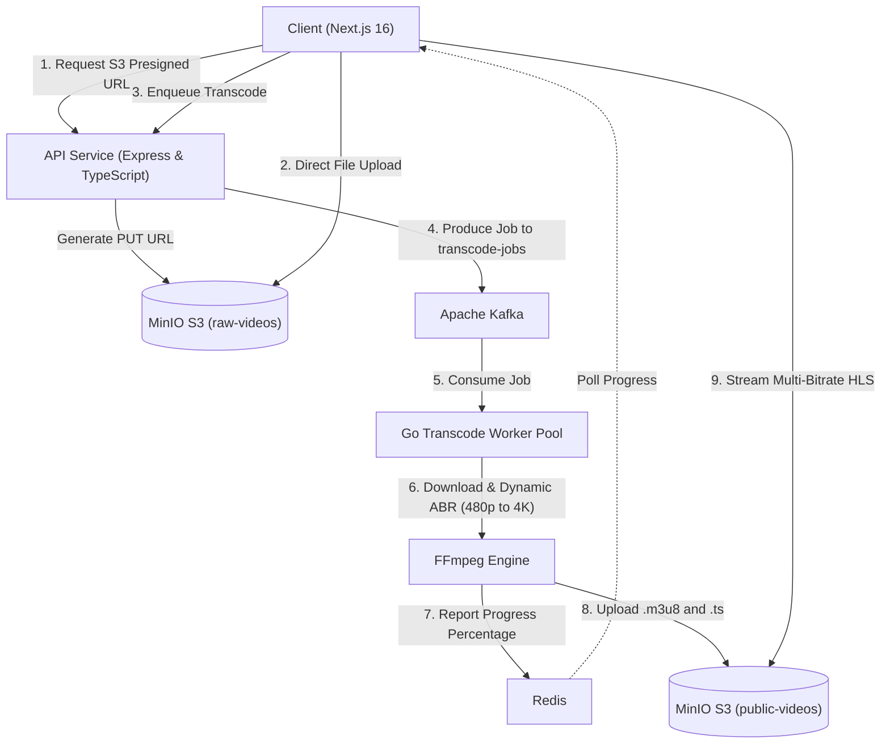

# 🎥 Distributed Video Transcoder (VOD & Adaptive HLS Engine)

An enterprise-grade, distributed asynchronous video transcoding system built with **Go**, **Apache Kafka**, **Redis**, **FFmpeg**, and **MinIO (S3)**.

---

## 🌟 Highlights & Architecture

- ⚡ **Direct-to-S3 Presigned Ingestion:** Eliminates API server upload bottlenecks by streaming master video files directly to S3/MinIO using presigned PUT URLs.
- 📬 **Decoupled Kafka Event Pipeline:** High-throughput task dispatching using Kafka topic `transcode-jobs`.
- ⚙️ **Dynamic Adaptive Bitrate (ABR) Ladder:** Automatically inspects input source video dimensions via `ffprobe` and downscales into standard HLS renditions up to 4K (2160p, 1440p, 1080p, 720p, 480p) with synchronized GOP keyframes (`-g 48 -keyint_min 48`).
- 📈 **Real-Time Transcode Progress Stream:** Worker parses FFmpeg stderr timestamp progression and pushes percentage status into Redis in real-time.
- 📺 **Adaptive HLS Web Player:** Next.js 16 + React 19 web application with Hls.js quality switching, real-time upload progress, and video gallery.

---

## 🏗️ System Architecture



---

## 🗂️ Project Layout

```text
distributed-video-transcoder/
├── api-service/              # Node.js + Express + TypeScript API gateway
│   ├── src/
│   │   ├── config/           # Kafka producer, Redis, and S3 clients
│   │   ├── controllers/      # Presigned URL generation, job enqueuing, progress
│   │   ├── routes/           # REST endpoints (/api/upload-url, /api/transcode, etc.)
│   │   └── server.ts         # Bootstrapping & S3 bucket initialization
├── transcode-worker/         # Scalable Go Transcoding Engine
│   ├── cmd/worker/main.go    # Concurrent worker pool daemon
│   ├── internal/
│   │   ├── pool/             # Worker pool management
│   │   ├── transcoder/       # FFmpeg wrapper & dynamic ABR ladder generator
│   │   └── config/           # Kafka consumer, Redis, and MinIO clients
├── client-demo/              # Next.js 16 + React 19 Frontend
│   ├── src/app/upload/       # Direct S3 upload & live progress tracking
│   ├── src/app/watch/        # HLS video player & catalog gallery
└── docker-compose.yml        # Kafka, Redis, MinIO, and PostgreSQL infrastructure
```

---

## 🚀 Quick Start

### 1. Start Infrastructure
```bash
docker compose up -d
```
Services:
- MinIO S3 API: `http://localhost:9000` (Console: `http://localhost:9001`)
- Kafka Broker: `localhost:29092`
- Redis: `localhost:6379`
- PostgreSQL: `localhost:5432`

### 2. Start API Service
```bash
cd api-service
npm install
npm run dev
```
Runs on `http://localhost:3001`.

### 3. Start Transcode Worker
```bash
cd transcode-worker
go mod download
go run cmd/worker/main.go
```

### 4. Start Web Client
```bash
cd client-demo
npm install
npm run dev
```
Open `http://localhost:3000` to upload and play videos!

---

## 📄 License
ISC
